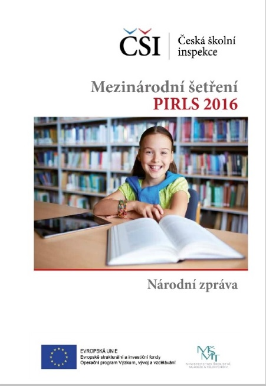

Mezinárodní šetření PIRLS (Progress in International Reading Literacy Study) je zaměřeno na testování čtenářské gramotnosti žáků 4. ročníku základních škol. Cyklus tohoto šetření je pětiletý. Šetření je na mezinárodní úrovni koordinováno Mezinárodní asociací pro hodnocení výsledků vzdělávání (The International Association for the Evaluation of Educational Achievement – IEA), v ČR je jeho realizátorem Česká školní inspekce. Šetření PIRLS se snaží také zmapovat význam rodinného, školního a širšího prostředí žáků pro rozvoj čtenářské gramotnosti.

Čtenářská gramotnost je v šetření PIRLS chápána jako tvořivý a interaktivní proces, při kterém se klade důraz na funkční povahu čtení. Čtenáři by v tomto pojetí měli ovládat čtenářské strategie, při kterých uplatňují své znalosti a zkušenosti, přemýšlí o tom, co si přečetli, vytváří si vlastní představy a identifikují podstatné informace a myšlenky.
 
