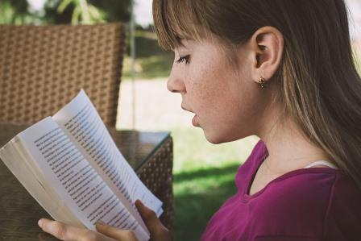

Dílna čtení je celoroční systém práce, který pomáhá žákům v tom, aby se stali skutečnými čtenáři. Jedná se o praktický systém určený dětem od 3. do 9. třídy a vychází z programu RWCT (Čtením a psaním ke kritickému myšlení) a nabízí možný způsob, jak rozvíjet čtenářské dovednosti, jak rozečíst děti, které se dosud četbě vyhýbaly, a vytvořit ve třídě čtenářské společenství. V dílně čtení žáci pravidelně čtou souvislé beletristické texty, přemýšlí, hovoří a píšou o nich. Dílna čtení umožní pracovat zároveň individuálně i společně, každý žák má knihu přiměřenou své aktuální čtenářské úrovni.